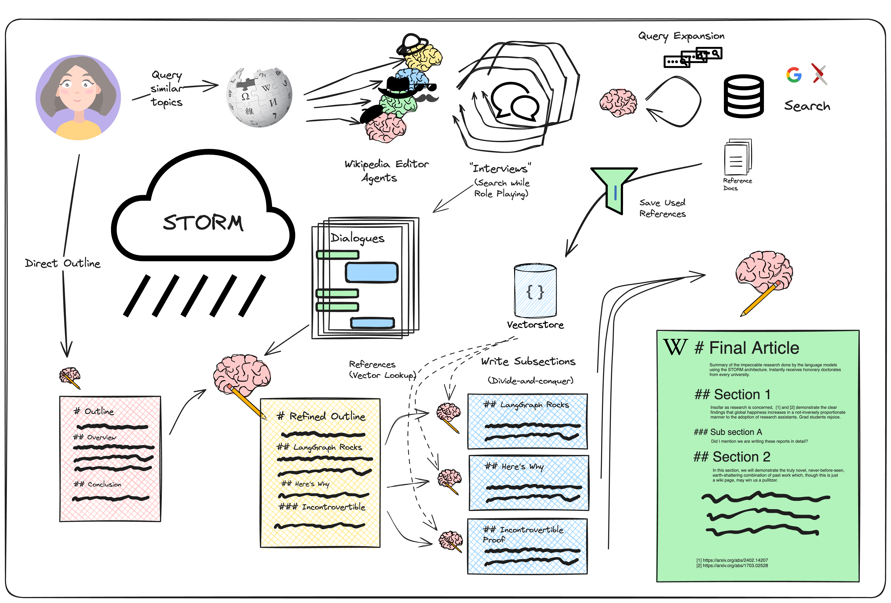

# 🦜️🔗🌩️ langchain_storm

## 📝🌐 Assisting in Writing Wikipedia-like Articles From Scratch with Large Language Models

This project explores how large language models (LLMs) can be used to write well-structured and informative long-form
articles from scratch, similar to Wikipedia pages. It tackles the challenges of the pre-writing stage, including
researching the topic and creating an outline.

## 🤔 What is STORM?

[STORM](https://arxiv.org/abs/2402.14207) is a research assistant designed by Shao, et. al that extends the idea of
“outline-driven RAG” for richer article generation.

STORM is designed to generate Wikipedia-style ariticles on a user-provided topic. It applies two main insights to
produce more organized and comprehensive articles:

1. Creating an outline (planning) by querying similar topics helps improve coverage.
2. Multi-perspective, grounded (in search) conversation simulation helps increase the reference count and information
   density.

The control flow looks like the diagram below.



STORM has a few main stages:

1. Generate initial outline + Survey related subjects
2. Identify distinct perspectives
3. "Interview subject matter experts" (role-playing LLMs)
4. Refine outline (using references)
5. Write sections, then write article

The expert interviews stage ocurrs between the role-playing article writer and a research expert. The "expert" is able
to query external knowledge and respond to pointed questions, saving cited sources to a vectorstore so that the later
refinement stages can synthesize the full article.

## 🚀 Quick Start

1. **Clone this repository:**

```bash
git clone https://github.com/abdalrohman/langchain_storm.git
```

2. **Make sure you have Poetry and Python 3.9 or above installed.**
3. **Enter the project directory:**

```bash 
cd langchain_storm
```

4. **Install the required dependencies:**

```bash
poetry install
```

5. **Activate the poetry shell:**

```bash
poetry shell
```

6. **Rename .env.example to .env if you want to use a .env file to store your API keys. Otherwise, you can set the keys
   directly in the Streamlit sidebar.**
7. **Set your API keys for OpenAI, Fireworks, and Google (if using those options) in the .env file or directly in the
   Streamlit sidebar.**
8. **Run the application:**

```bash
streamlit run app.py
or
python cli.py --topic [your_topic]
```

9. **If using streamlit Enter a topic in the text box and click "Generate article".**

## 📖 Documentation

For detailed information about STORM, the FreshWiki dataset, and the evaluation process, please refer to the following
resources:

*
Paper: [Assisting in Writing Wikipedia-like Articles From Scratch with Large Language Models](https://arxiv.org/abs/2402.14207)
* Original Notebook: [STORM Notebook](https://github.com/langchain-ai/langgraph/blob/main/examples/storm/storm.ipynb)

## 📌 Additional Notes

* The quality of the generated article depends on the chosen language model, embeddings, and the complexity of the
  topic.
* This application is for research and demonstration purposes and may not be suitable for production use cases.

## 📝 License

This project is licensed under the MIT License. See the LICENSE file for details.
